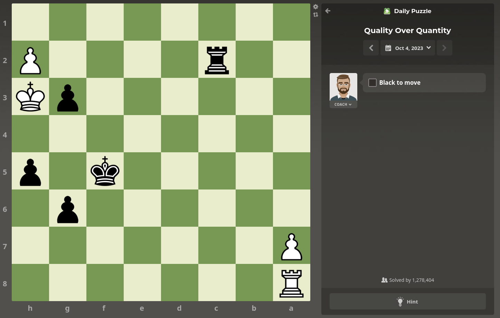
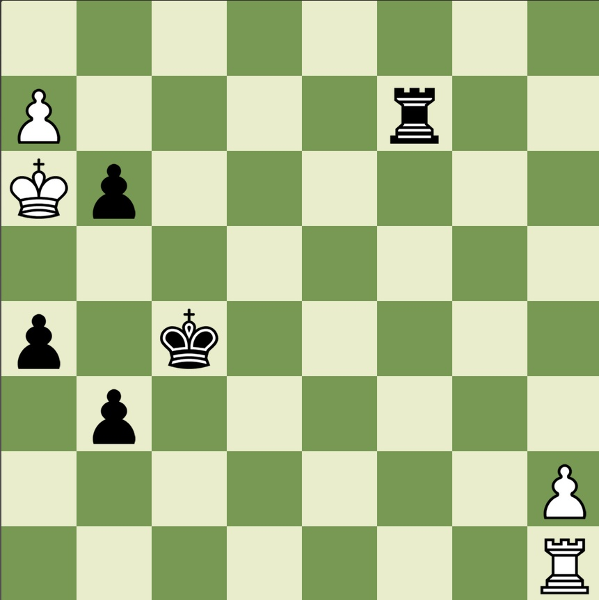

# chessboard2fen
The goal of this project is to detect a chessboard from the image of a chessboard and to predict its configuration. The configuration prediction is returned using the [Forsyth-Edwards Notation](https://en.wikipedia.org/wiki/Forsyth%E2%80%93Edwards_Notation). 

## Usage 
Ensure that tensorflow package is installed. The chessboard cannot be slanted and should be least 25% of the image for good detection. Save the image file as a jpeg/png file and run  
`python src/chessboard_detect.py filename`.  
This will store the image of the detected chessboard in `detected_chessboard.jpg` by default and display the FEN string in the terminal. You can modify the location of the saved chessboard image using `--output=output_filename` or `-o=output_filename`.  
If the chessboard is upside down i.e. the bottom-left square is h8 instead of a1, you should include the `--flip` or `-f` flag to get the correct FEN string.  

If your image is already cropped to the chessboard, you can run  
`python src/chessboard_to_fen.py filename`  
to bypass the detection step and just display the FEN string. Use the `--flip` or `-f` flag in the chessboard is upside down.

### Sample Usage: 
Running `python src/chessboard_detect.py docs/media/sample.png -o docs/media/detected.jpg`
with sample image  
  
produces  
  
and predicts FEN string to be `8/P4r2/Kp6/8/p1k5/1p6/7P/7R`.

## Project structure
The project is structured as follows:  

* dataset - contains training data for the convolutional neural network.  
* docs - folder containing the assets associated to this README file.  
* src - contains the codebase for the program.  
    - src/chessboard_detect.py - to detect the chessboard in an image.  
    - src/chessboard_to_fen.py - to predict FEN string of a chessboard.  
    - src/piece_classifier.py - to classify a single square of a chessboard.  
    - src/train_cnn_model.py -  trains a convolutional neural network used to classify squares of a chessboard.   
    - src/model_weights.index - stores the weights of the trained convolutional neural network model.  
    - src/ulits.py - contains some commonly used functions .  
* tests - (TBD) to store test cases.  

## Issues and further things to be done
* Improve the chessboard detection algorithm to include cases where the chessboard is slanted. 
* The CNN is currently trained only on square and pieces generated using chess.com themes, and might not perform well on other kinds of boards. The model may need to be fine-tuned for other use cases. 

## Acknowledgements
The neural network is trained using a subset of [this kaggle dataset](https://www.kaggle.com/datasets/koryakinp/chess-positions) created by Pavel Koryakin.
This project is inspired by [chessvision-ai](https://chessvision.ai/) and their reddit bot [/u/chessvision-ai-bot](https://reddit.com/u/chessvision-ai-bot). 
